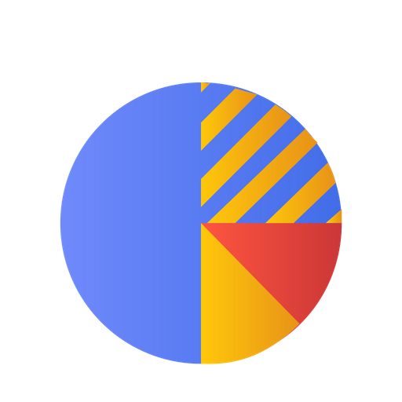

<!-- PROJECT LOGO -->
<br />
<p align="center">
  <a href="https://github.com/Jotahflo/polls">
    
  </a>

  <h3 align="center">Proyecto Polls</h3>

  <p align="center">
    A website of a small polls together with your reports
    <br /> 
    <a href="https://github.com/Jotahflo/polls"><strong>Explore the docs »</strong></a>
    <br />
    <br />
    <a href="https://pollsjf.herokuapp.com/">View Page</a>
    ·
    <a href="https://github.com/Jotahflo/polls/issues">Report Bug</a>
    ·
    <a href="https://github.com/Jotahflo/polls/issues">Request Feature</a>
  </p>
</p>

<!-- TABLE OF CONTENTS -->
<details open="open">
  <summary>Table of Contents</summary>
  <ol>
    <li>
      <a href="#about-the-project">About The Project</a>
      <ul>
        <li><a href="#built-with">Built With</a></li>
      </ul>
    </li>
    <li>
      <a href="#getting-started">Getting Started</a>
      <ul>
        <li><a href="#prerequisites">Prerequisites</a></li>
        <li><a href="#installation">Installation</a></li>
      </ul>
    </li>
    <li><a href="#license">License</a></li>
    <li><a href="#contact">Contact</a></li>
    <li><a href="#acknowledgements">Acknowledgements</a></li>
  </ol>
</details>

<!-- ABOUT THE PROJECT -->

## About The Project

[![Product Name Screen Shot][product-screenshot]](https://Jfloresvid.github.io/portfolio)

This project is a web page that allows you to enter data with a form and show them by graphics and tables.

### Built With

The major frameworks that use in this project are:

- [Laravel](https://laravel.com/)
- [Bootstrap](https://getbootstrap.com/)

<!-- GETTING STARTED -->

## Getting Started

To get a local copy up and running this project follow these simple example steps.

### Prerequisites

This is an list things you need to running the project and how to install them.

- Installed PHP 5.6.4, MariaBD 10.6.4 and nginx (only is important to have the same PHP version) (In CentOS/RHEL, remplacement "apt-get" for "yum") (In Windows, download from [php.zip](https://windows.php.net/downloads/releases/archives/php-5.6.9-Win32-VC11-x64.zip))

  ```sh
  sudo apt-get install php5-dev php5-cli php5 php5-pear
  sudo apt-get install mariadb-client mariadb-server
  sudo apt-get install nginx
  ```

- Installed composer in linux (In windows, download from [Composer-Setup.exe](https://getcomposer.org/Composer-Setup.exe) and run)

  ```sh
  php composer-setup.php --install-dir=bin --filename=composer
  ```

### Installation

1.  Clone the repo
    ```sh
    git clone https://github.com/Jotahflo/polls.git
    ```
2.  Install Composer packages

    ```sh
    composer install
    ```

3.  Create environment local files in the root directory of the project with your database credentials

    ```sh
    file: .env

    APP_NAME=Polls
    APP_ENV=local
    APP_KEY=base64:6+jqLtZTMIB2BWEaUBq0Ac7aiJ0mEVtzGXKfFzdsBWA=
    APP_DEBUG=true
    APP_LOG_LEVEL=debug
    APP_URL=http://localhost

    DB_CONNECTION=your_database_type
    DB_HOST=your_database_host
    DB_PORT=your_database_port
    DB_DATABASE=your_database_name
    DB_USERNAME=your_database_username
    DB_PASSWORD=your_database_password
    ```

4.  Create and use a database

    ```sql
      create database polls character set utf8mb4 collate utf8mb4_spanish_ci;
      use polls;
    ```

5.  Create tables and insert data in database

    ```sh
      php artisan migrate:refresh --seed
    ```

6.  Start local server with command or use XAMPP, Laragon or other alternative

    ```sh
      php artisan serve
    ```

7.  Access to page in local server

<!-- LICENSE -->

## License

Distributed under the MIT License. See `LICENSE` for more information.

<!-- CONTACT -->

## Contact

Juan Flores - [LinkedIn](https://www.linkedin.com/in/jfloresvid) - j.floresvid@gmail.com

<!-- ACKNOWLEDGEMENTS -->

## Acknowledgements

- [Laravel Excel](https://laravel-excel.com/)
- [Chart.js](https://www.chartjs.org/)

[product-screenshot]: resources/assets/preview.png
